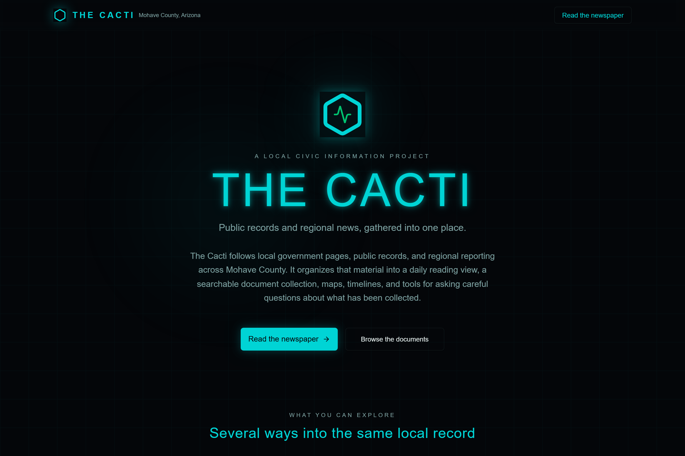

<p align="center">
  
</p>

# The Cacti

**A self-hosted civic reading and research workspace that gathers Mohave County public records and regional news into one place.**

The Cacti collects material from local government pages, public records, RSS feeds, and regional reporting. It uses an LLM provider you choose to organize that material into city newspaper editions, a searchable document collection, maps, timelines, relationship views, alerts, and working reports—with the original sources kept within reach.



*The public introduction keeps the purpose simple: several ways to explore the same local record.*

> **Project status:** working beta and portfolio release. The repository contains the application and default Mohave County source catalog, but it does not contain a hosted service, runtime database, user accounts, or API keys.

---

## Who this is for

You might be:

- **A Mohave County resident** who wants one place to begin reading about local government and regional activity.
- **Someone working in a nonprofit, newsroom, library, classroom, or civic organization** who wants to study how public information can be gathered and made easier to navigate.
- **A researcher or student** interested in source-connected AI summaries, local information systems, or public-interest technology.
- **A developer or designer** looking for a complete example of a regional ingestion pipeline paired with a public reading interface and owner controls.

No specialized background is required to understand the project. The public views are meant for reading; the owner views are where source configuration, ingestion, alerts, and model settings live.

---

## What it actually does

The application follows a simple cycle:

1. **You choose the public sources.** The included configuration starts with Mohave County and its major cities, but the source list is editable.
2. **The ingestion pipeline checks those sources.** It reads RSS feeds and public webpages, skips duplicates, and records source health along the way.
3. **Your selected LLM provider helps organize new material.** It classifies topics, extracts recurring entities, and produces draft summaries for the reading and research views.
4. **The material becomes browsable in several forms.** You can read city newspaper editions, search individual documents, follow a timeline, browse a map, or inspect recurring connections.
5. **Owner tools support closer review.** The owner can ask questions across the collected material, generate reports, configure alerts, and monitor the source pipeline.
6. **The original record remains the reference point.** Generated newspaper stories retain citations to supporting documents so an important claim can be checked rather than accepted on presentation alone.


*A fresh installation begins honestly empty. Once the owner has collected source material and reviewed generated stories, this same view becomes the daily city edition.*

---

## What is inside

- **City newspaper editions** for Kingman, Bullhead City, Lake Havasu City, Mohave County, and broader Arizona groupings.
- **Searchable source documents** with categories, locations, dates, summaries, and links to the original material.
- **Map and timeline views** for moving through the collection by place and sequence.
- **A relationship graph** connecting recurring people, organizations, locations, dates, and money references found in the documents.
- **Questions and generated reports** over the local document collection.
- **Configurable alerts** based on keywords, topic signals, sentiment, and estimated impact.
- **Source-health and scheduling controls** for the owner running the collection pipeline.
- **Gemini, OpenAI, and DeepSeek support** behind one provider-neutral application layer.
- **Tiered access** for anonymous readers, signed-in readers, and the owner administration surface.

---

## Why the project is structured this way

Local information is usually not absent; it is fragmented. A city notice may live on one page, a county agenda on another, and regional reporting somewhere else. Following a subject means remembering which sites exist, checking each one repeatedly, and reconstructing the sequence by hand.

The Cacti explores a different shape: collect a known set of public sources, preserve where each item came from, then offer several ways to read the same underlying material. The newspaper helps someone begin. Search and documents support verification. Maps, timelines, and connections help someone notice context that a single feed cannot show.

The project is not designed to determine what is true on a reader's behalf. It is designed to make the underlying material easier to find, compare, and revisit.

---

## How AI is used—and where human judgment remains necessary

The Cacti uses language models to classify documents, extract entities, summarize material, answer questions, and draft newspaper stories and reports. Those outputs can be incomplete, misleading, or wrong even when they cite a real source.

Treat generated text as a reading aid, not an established finding. Follow citations, read the original record, and verify consequential claims independently. A valid citation proves that a source exists; it does not prove that the model represented the source correctly or that the source itself is accurate.

The repository contains no prebuilt dossiers and no runtime document collection. Anyone operating a deployment is responsible for choosing appropriate public sources, respecting source terms, protecting account information, and using the resulting material responsibly.

---

## Try it locally

> **Heads up:** this is currently a self-hosted developer project. You will need to clone the repository, configure Google OAuth, and provide your own LLM API key before owner-only functions can run. Anonymous pages can be viewed without signing in.

### What you will need

- [Node.js](https://nodejs.org/) 20 or newer.
- [pnpm](https://pnpm.io/installation) 10.
- A Google OAuth web application for sign-in.
- A long random JWT secret for session cookies.
- An API key for at least one supported provider: Google Gemini, OpenAI, or DeepSeek.

### Setup

```bash
git clone https://github.com/anitacigawet/The-Cacti.git
cd The-Cacti

pnpm install
cp .env.example .env
```

Edit `.env` and add:

- your Google OAuth client ID and secret;
- a `JWT_SECRET`;
- the email that should become the owner account;
- at least one LLM provider key, either in `.env` or later through Settings.

For local Google OAuth, use this authorized redirect URI:

```text
http://localhost:3002/api/auth/google/callback
```

Then start the application:

```bash
pnpm dev
```

Open [http://localhost:3002/about](http://localhost:3002/about). On Windows, `start.bat` provides the same local launch flow and looks for an available port beginning with 3002.

After signing in with the configured owner email:

1. Open **Settings** and choose an LLM provider.
2. Open **Data Monitor** and seed the default source list.
3. Run the pipeline manually once before enabling any schedule.
4. Review the collected documents and generated output before sharing a deployment.

The database and settings are written under `data/`, which is excluded from Git. See [Configuration](docs/CONFIGURATION.md) for the complete environment reference.

---

## What works today

- Local SQLite persistence with automatic migrations.
- Google OAuth and three access tiers.
- Configurable RSS and webpage ingestion.
- Duplicate checks, Arizona relevance filtering, and source-health tracking.
- Multi-provider LLM analysis through Gemini, OpenAI, or DeepSeek.
- Newspaper, document, map, timeline, graph, dashboard, alert, report, and settings views.
- Manual and scheduled ingestion controls.
- Optional owner email notifications through Resend.
- Production build and Railway configuration.

## Known limits

- Public websites change; individual source adapters may stop working and require maintenance.
- The default source catalog is a starting point, not a comprehensive record of Mohave County.
- Model-generated classifications, summaries, connections, and reports require human review.
- Forks are possible but are not backed by an active support commitment.
- The repository does not include a populated demo database, so a fresh local copy begins empty.

---

## How the repository is organized

- **`client/`** — React application: public reading views, research views, and owner settings.
- **`server/`** — Express and tRPC backend, ingestion pipeline, authentication, alerts, and LLM routing.
- **`shared/`** — region settings and types used by the client and server.
- **`config/`** — the default Mohave County source catalog.
- **`drizzle/`** — SQLite schema and migrations.
- **`docs/`** — configuration guidance and public screenshots.
- **`scripts/`** — focused maintenance utilities.

The main regional adaptation points are documented in [Forking The Cacti](FORKING.md).

---

## Suggestions and contributions

Bug reports, thoughtful suggestions, and focused pull requests are welcome. This is a portfolio project rather than a supported public service, so submissions may remain open and are not guaranteed to be implemented.

Please read [CONTRIBUTING.md](CONTRIBUTING.md) before submitting changes. Do not include API keys, private account data, runtime databases, or personal records in an issue or pull request.

---

## Credits

The Cacti was conceived and directed in Kingman, Arizona, as an exploration of how regional public information can become easier to read without losing its connection to the original record.

The application uses open-source libraries across the React, Express, tRPC, Drizzle, D3, and Radix ecosystems. Optional analysis is provided through the API account selected by the person running the application.

---

## A note on intent

The project begins with a modest idea: understanding local activity should not require knowing every website to check in advance. A useful civic tool can gather the starting points, show where the material came from, and leave the final judgment with the reader.

---

## License

The Cacti is **source-available**, not open source. It is licensed by **ScootSolute LLC** under the [PolyForm Noncommercial License 1.0.0](LICENSE).

You may study, modify, and redistribute the software for permitted noncommercial purposes under the license terms. Commercial use is not granted. Third-party packages remain subject to their own licenses.
