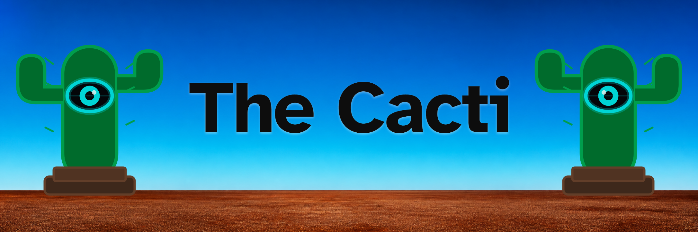
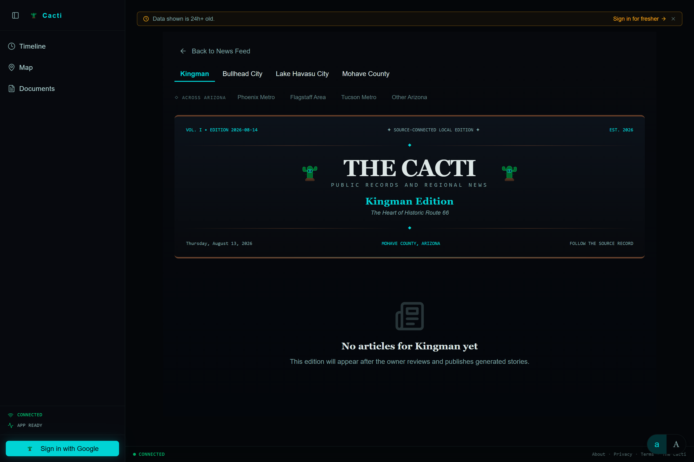

<p align="center">
  
</p>

## What is this?

The Cacti collects Mohave County public records and regional news in one place. It turns that material into city newspaper editions, a searchable document collection, maps, timelines, relationship views, alerts, and reports.

Generated newspaper stories link back to their source material so you can check the original record.

## Who is this for?

The Cacti is for people who want to follow Mohave County public information without checking every city, county, and news website separately. The person running the installation controls the sources, ingestion schedule, alerts, access levels, and AI provider.

## What it actually does

- Collects configured RSS feeds and public webpages.
- Skips duplicate items and records whether each source is working.
- Uses Gemini, OpenAI, or DeepSeek to classify topics, extract recurring people, organizations, and locations, and create draft summaries.
- Builds newspaper editions for Kingman, Bullhead City, Lake Havasu City, Mohave County, and broader Arizona coverage.
- Provides document search, map, timeline, and relationship-graph views.
- Answers questions and generates reports from the collected documents.
- Sends configurable alerts based on keywords, topics, sentiment, and estimated impact.
- Separates anonymous, signed-in, and owner access.

> AI-generated summaries, stories, and reports can be wrong. Check the linked source before relying on a generated claim.



## Running it locally

The quickest option is the portable runtime ZIP on the [Releases page](https://github.com/anitacigawet/The-Cacti/releases). It includes the built application and production dependencies, so it needs only Node.js. Extract it and run `run.bat` on Windows or `sh run.sh` on macOS or Linux. The included [runtime guide](RUNTIME.md) covers configuration and first launch.

To run from source, you will need:

- [Node.js](https://nodejs.org/) 20.19+ on the Node 20 line, or 22.12+.
- [pnpm](https://pnpm.io/installation) 10.
- A Google OAuth web application if you want sign-in.
- An API key for Gemini, OpenAI, or DeepSeek if you want generated analysis.

Clone and start the project:

```bash
git clone https://github.com/anitacigawet/The-Cacti.git
cd The-Cacti
pnpm install --frozen-lockfile
cp .env.example .env
pnpm dev
```

Open the `Server running on ...` address printed in the console, then visit its `/about` route. It normally starts at [http://localhost:3002](http://localhost:3002), but selects a higher free port when that port is busy. On Windows, `start.bat` runs the same development server.

For Google sign-in, add a long random `JWT_SECRET`, the Google OAuth credentials, and your `OWNER_EMAIL` to `.env`. Use this authorized redirect URI:

```text
http://localhost:3002/api/auth/google/callback
```

If 3002 is unavailable and you need sign-in, stop the server, set `PORT` and `PUBLIC_URL` to the same chosen free port, update the Google authorized redirect URI to that port, and restart.

After signing in as the owner:

1. Open **Settings** and choose an AI provider.
2. Open **Data Monitor** and seed the default source list.
3. Run the pipeline manually once.
4. Review the collected documents and generated output before enabling a schedule.

The database and settings stay under the ignored `data/` directory. See [Configuration](docs/CONFIGURATION.md) for the environment reference.

## Extreme technicals below

Maintainers and coding agents working from source should begin with [START_HERE.md](https://github.com/anitacigawet/The-Cacti/blob/main/START_HERE.md).

### Known limits

- The default catalog does not contain every Mohave County public-information source.
- Public websites change, so individual source adapters can stop working and require maintenance.
- A fresh installation contains no collected records.

### Repository layout

- **`client/`** — React application and its public, research, and owner views.
- **`server/`** — Express and tRPC server, ingestion, authentication, alerts, and AI routing.
- **`shared/`** — region values used by the client and server.
- **`config/`** — default Mohave County source catalog.
- **`drizzle/`** — SQLite schema and runtime migrations.
- **`docs/`** — configuration and README images.

### Builds

```bash
pnpm verify
```

That command runs type checking, the normal production build, and the showroom build. The normal build goes to `dist/`. The showroom build goes to `dist/showroom/`; it uses a fixed demonstration dataset in the browser and makes no application API calls. Run `pnpm preview:showroom` to serve it locally with SPA fallback.

`pnpm release:stage` builds the application and creates a portable production tree under `.release/runtime/`. That staging directory is what the release ZIP contains; ZIP creation and checksums are separate release steps.

### License

The Cacti is source-available under the [PolyForm Noncommercial License 1.0.0](LICENSE), not open source. ScootSolute LLC licenses the project for permitted noncommercial use; commercial use is not granted. Third-party packages keep their own licenses.
